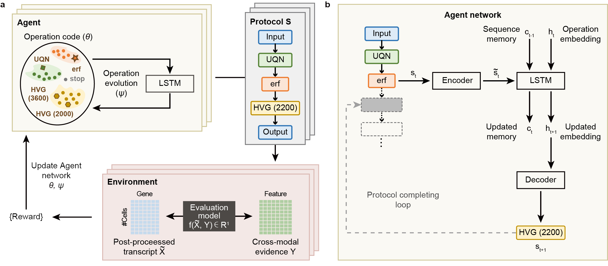

# autoCOPE: Optimizing Transcript Preprocessing Strategies through Reinforcement Learning

autoCOPE is a multi-omics reinforcement learning (RL) structure to automatically design preprocessing protocols for accurate biological discoveries.


## Overview

Transcriptomics is the most studied biological modality with rapidly increasing data quantity and heterogeneity. However, interpretable and robust preprocessing pipelines for transcript ad hoc remains a challenge. Here, we present autoCOPE (automatic CustOmization of PreprocEssing protocols), a model to design dynamic pipeline for preprocessing transcripts ad hoc of any kind, by combining the interpretability of simple scaling, normalization or feature selection operations, and the design power of reinforcement learning guided by simultaneous (Patch-seq, CITE-seq and Spatial Transcriptomics) or independent (STARmap) multi-omics assays.


**Fig. 1 | autoCOPE designs transcript preprocessing protocols guided by paired cross-modal evidences.** (**a**) Depiction of the autoCOPE design loop. The Agent generates protocols for preprocessing transcripts and these generated protocols are sent to the Environment to quantify the coherence to paired cross-modal evidences as a reward signal. The Environment then feeds the reward signal to the Agent to update network’s parameters for better protocol design. (**b**) Our Agent is built upon a recurrent LSTM architecture to recursively select preprocessing operations and assemble them in order as a protocol. Encoders and decoders across varying time steps share the same parameters.


## Environment

In order to effectively utilize the preprocessing computational capabilities of this project, users are required to set up environments for both Python and R. This involves installing specific packages for each language.

* This repository is built and tested in the same Linux server (Ubuntu 18.04.1 operation system) with Xeon Gold 6226R CPU and Nvidia RTX3090 GPU (driver version: 460.39, CUDA version: 11.0)

```terminal
git clone https://github.com/EronHou/autoCOPE
```

* Open R (version: 4.3.2) and install the dependencies via the commands:

```terminal
install.packages(c('devtools', 'BiocManager'))
install.packages("rsvd")
update.packages(ask=F)
BiocManager::install(version = "3.18")
BiocManager::install(c("BiocNeighbors","BiocSingular","scran","EBSeq","Linnorm","SingleCellExperiment","edgeR"))
```

* We recommend you to use Anaconda to create a conda environment. To configure a conda environment, the following instructions must be followed. Setup the dependencies from the `environment_autocope.yml` file: 

```terminal
conda env create -f environment_autocope.yml -n autoCOPE
conda activate autoCOPE
```


## Usage

### Interpreter Case (Recommend for users)

* Users can get the designed transcript preprocessing protocols by running `auto_design.py` file. Post-processed transcripts can be further obtained by running `./utils/extract_scheme_top1.py` file.
  
* We recommend you to conduct `auto_design.py` and `./utils/extract_scheme_top1.py` files in the python interpreter (like PyCharm) directly, and setup the parameters (Hdf5Path_ref, Hdf5Path_target, task, save_path, graph_path) following the ternimal case. Using interpreter can avoid potential unstable factors in the ternimal mode.


### Ternimal Case

* By running `auto_design.py` file, users can get the designed transcript preprocessing protocols. The input data for autoCOPE are two .h5 files containing transcript count matrix and biological evidence matrix respectively. The output is a .npy file containing the designed graph.

```terminal
python auto_design.py --Hdf5Path_ref path_trans_count --Hdf5Path_target path_biological_evidence --task design_mode
```
where
```
Parameters:

  Hdf5Path_ref:      path for the transcript count .h5 file；。X represents matrix of  c1 * g1, where c1 = number of cells, g1 = number of genes.
  Hdf5Path_target:   path for the biological evidence .h5 file; 。X represents matrix of  c2 * g2, where c2 = number of cells, g2 = number of genes.
  task:              the design mode for autoCOPE; ‘cell_discrete’ for paired discrete evidences along cell dimension; ‘cell_continuous’ for paired continuous evidences along cell dimension; 'gene_continuous' for paired continuous evidences along gene dimension.

Returns:
  The designed graph is stored in the folder './ppo_search_XXXXXXXX-XXXXXX/top_5_computation_graph/epoch49_top_0_graph.npy'
```

* By running `./utils/extract_scheme_top1.py` file, transcript count profiles are processed through the designed graph from the first step. The input data for `./utils/extract_scheme_top1.py` are the designed .npy graph and the transcript count .h5 file. The output is a post-processed transcript count .h5 file. 

```terminal
python ./utils/extract_scheme_top1.py --Hdf5Path_ref path_trans_count --save_path path_postprocessed_transcript --graph_path designed_graph
```

where

```
Parameters:

  Hdf5Path_ref:      path for the transcript count .h5 file；。X represents matrix of  c1 * g1, where c1 = number of cells, g1 = number of genes.
  save_path:         path to save the postprocessed transcript count .h5 file.
  graph_path:        path for the designed graph .npy file.

Returns:
  The post-processed transcript .h5 file is stored in the folder 'save_path'.
```

## Demonstration

* We provide a demonstration of applying autoCOPE on a downsampled protein dataset profiled by CITE-seq where protein signals are biological evidences to guide the pipeline design process. Users can conduct the demonstration in the interpreter with default parameters easily.

* Alternatively, terminal commands for demonstration are supported as follows:
  1. Design transcript preprocessing protocols
        ```terminal
        python auto_design.py --Hdf5Path_ref ./data/trans_CD8.h5 --Hdf5Path_target ./data/protein_CD8.h5 --task cell_continuous
        ```

  2. Extract post-processed transcripts

        ```terminal
        python ./utils/extract_scheme_top1.py --graph_path ./search_PPO_20240124-214000/top_5_computation_graph/epoch_49_top_0_0.68906707_graph.npy --Hdf5Path_ref ./data/trans_CD8.h5 --save_path ./result/
        ```

  3. Inspect the data

        ```python
        import scanpy as sc
        path_transcript_before = './data/trans_CD8.h5'
        data = sc.read(path_transcript_before)
        data, data.X.toarray()
        
        path_transcript_before = './result/trans_processed.h5'
        data = sc.read(path_transcript_before)
        data, data.X
        ```


## Copyright
Software provided as is under **MIT License**.

Yimin Hou @ Deng ai Lab @ BUAA 2024.

Permission is hereby granted, free of charge, to any person obtaining a copy of this software and associated documentation files (the "Software"), to deal in the Software without restriction, including without limitation the rights to use, copy, modify, merge, publish, distribute, sublicense, and/or sell copies of the Software, and to permit persons to whom the Software is furnished to do so, subject to the following conditions:

The above copyright notice and this permission notice shall be included in all copies or substantial portions of the Software.

THE SOFTWARE IS PROVIDED "AS IS", WITHOUT WARRANTY OF ANY KIND, EXPRESS OR IMPLIED, INCLUDING BUT NOT LIMITED TO THE WARRANTIES OF MERCHANTABILITY, FITNESS FOR A PARTICULAR PURPOSE AND NONINFRINGEMENT. IN NO EVENT SHALL THE AUTHORS OR COPYRIGHT HOLDERS BE LIABLE FOR ANY CLAIM, DAMAGES OR OTHER LIABILITY, WHETHER IN AN ACTION OF CONTRACT, TORT OR OTHERWISE, ARISING FROM, OUT OF OR IN CONNECTION WITH THE SOFTWARE OR THE USE OR OTHER DEALINGS IN THE SOFTWARE.